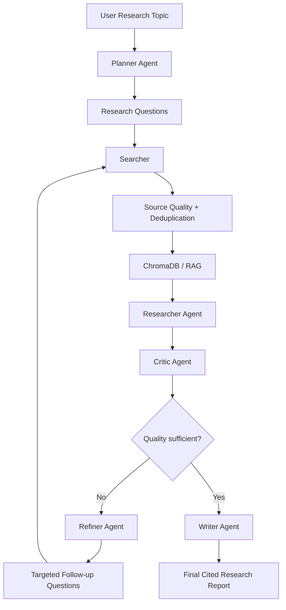

# ResearchForge AI

ResearchForge AI is an end-to-end multi-agent research platform that turns a user topic into a structured, evidence-backed research report.

Instead of treating research as a single LLM response, ResearchForge separates the workflow into explicit stages for planning, web search, retrieval, evidence synthesis, quality review, refinement, and report generation.

## Core Workflow



## What Makes the Project Interesting

ResearchForge does not claim that AI-powered research itself is new. Its engineering focus is on making the research pipeline modular, auditable, and evidence-aware.

Key design decisions include:

- Explicit Planner → Searcher → Researcher → Critic → Refiner → Writer workflow
- Retrieval-Augmented Generation using ChromaDB
- Research-session isolation using a unique `research_id`
- Source normalization, deduplication, authority scoring, and reranking
- Deterministic source IDs such as `S1`, `S2`, and `S3`
- Citation validation so the LLM cannot invent arbitrary URLs
- Critic-driven bounded refinement loops
- Structured Gemini output validated with Pydantic
- Section-level citations in the final report
- Source-linked research visuals
- Clean frontend-safe API responses without exposing raw scraped source content

## Main Features

### Multi-Agent Research Pipeline

**Planner Agent**
- Converts a topic into focused research questions.
- Defines the initial research direction.

**Searcher**
- Searches the web using Tavily.
- Retrieves multiple candidate sources.
- Normalizes URLs and removes duplicates.
- Records source-quality metadata.

**RAG Layer**
- Stores research evidence in ChromaDB.
- Uses semantic retrieval to select relevant evidence for each question.
- Keeps research sessions isolated using `research_id`.

**Researcher Agent**
- Answers individual research questions using retrieved evidence.
- Produces summaries, key points, and trusted source IDs.

**Critic Agent**
- Evaluates completeness, evidence quality, source support, and missing information.
- Produces a research quality score, strengths, gaps, and recommendations.

**Refiner Agent**
- Generates targeted follow-up questions from unresolved Critic feedback.
- Triggers additional search and research when needed.

**Writer Agent**
- Synthesizes validated findings into a professional report.
- Produces an executive summary, report sections, conclusion, and bibliography.

### Evidence and Citation System

ResearchForge separates evidence retrieval from citation generation.

The model receives trusted source identifiers instead of being allowed to generate arbitrary source URLs. The backend validates returned source IDs and resolves them to known source metadata.

Example:

```json
{
  "source_ids": ["S1", "S4"],
  "sources": [
    {
      "source_id": "S1",
      "title": "Example Research Source",
      "url": "https://example.com/research"
    }
  ]
}
```

This reduces the risk of fabricated citations and keeps source references deterministic inside each research run.

### Source Quality Layer

The system assigns source metadata such as:

- domain
- source type
- quality score
- quality label
- primary-source indicator

The authority score is a heuristic used for ranking. It is not presented as proof that a source is factually correct.

### Research Refinement

ResearchForge can perform up to two refinement rounds.

Example:

```text
Initial Research
      ↓
Critic Score: 8/10
      ↓
Missing evidence identified
      ↓
Refiner creates follow-up questions
      ↓
Targeted Search + Research
      ↓
Critic evaluates again
      ↓
Final Report
```

### Research Visuals

The frontend can display images retrieved alongside cited web sources.

Visuals are shown as supporting context and are kept separate from research evidence. Images can be opened in a larger preview without cropping.

A future extension can add AI-generated explanatory diagrams for individual report sections.

## Technology Stack

### Backend

- Python
- FastAPI
- Pydantic
- Pydantic Settings
- Google Gemini API
- Tavily Search API
- ChromaDB
- Sentence Transformers
- LangChain text splitters
- Uvicorn

### Frontend

- Next.js
- React
- TypeScript
- Tailwind CSS
- Lucide React

### Deployment

Recommended production setup:

- Frontend: Vercel
- Backend: Railway
- Persistent vector storage: Railway Volume
- External services: Gemini API and Tavily API

## Project Structure

```text
ResearchForge-AI/
│
├── backend/
│   ├── app/
│   │   ├── agents/
│   │   │   ├── planner.py
│   │   │   ├── searcher.py
│   │   │   ├── researcher.py
│   │   │   ├── critic.py
│   │   │   ├── refiner.py
│   │   │   └── writer.py
│   │   │
│   │   ├── api/
│   │   │   └── routes/
│   │   │
│   │   ├── core/
│   │   │   └── config.py
│   │   │
│   │   ├── prompts/
│   │   ├── rag/
│   │   │   ├── embeddings.py
│   │   │   ├── loader.py
│   │   │   ├── retriever.py
│   │   │   └── vectorstore.py
│   │   │
│   │   ├── schemas/
│   │   ├── services/
│   │   └── main.py
│   │
│   ├── requirements.txt
│   └── .env
│
├── frontend/
│   ├── app/
│   ├── components/
│   ├── context/
│   ├── lib/
│   ├── types/
│   └── package.json
│
└── README.md
```

## Local Development

### 1. Clone the repository

```bash
git clone <YOUR_REPOSITORY_URL>
cd ResearchForge-AI
```

### 2. Backend setup

```bash
cd backend
python -m venv venv
```

Activate the virtual environment.

Windows:

```powershell
venv\Scripts\activate
```

macOS/Linux:

```bash
source venv/bin/activate
```

Install dependencies:

```bash
pip install -r requirements.txt
```

Create a `.env` file:

```env
GEMINI_API_KEY=your_gemini_api_key
TAVILY_API_KEY=your_tavily_api_key
ENVIRONMENT=development
FRONTEND_URL=http://localhost:3000
CHROMA_PATH=./chroma_db
```

Start the API:

```bash
uvicorn app.main:app --reload
```

Backend:

```text
http://localhost:8000
```

FastAPI documentation:

```text
http://localhost:8000/docs
```

### 3. Frontend setup

Open another terminal:

```bash
cd frontend
npm install
```

Create `.env.local`:

```env
NEXT_PUBLIC_API_BASE_URL=http://localhost:8000
```

Start the frontend:

```bash
npm run dev
```

Frontend:

```text
http://localhost:3000
```

## API

### Create Research Plan

```http
POST /research/plan
```

Example request:

```json
{
  "topic": "Impact of AI on software engineering"
}
```

### Run Complete Research Pipeline

```http
POST /research/analyze
```

Example request:

```json
{
  "topic": "Impact of AI on software engineering"
}
```

The response contains:

```text
research_id
topic
questions
sources
findings
critique
refinement_history
report
```

Raw scraped source content remains internal and is not exposed through the public API.

## Environment Variables

### Backend

| Variable | Purpose |
| --- | --- |
| `GEMINI_API_KEY` | Google Gemini API authentication |
| `TAVILY_API_KEY` | Tavily web search authentication |
| `ENVIRONMENT` | Application environment |
| `FRONTEND_URL` | Allowed production frontend origin |
| `CHROMA_PATH` | ChromaDB persistence directory |

### Frontend

| Variable | Purpose |
| --- | --- |
| `NEXT_PUBLIC_API_BASE_URL` | Public URL of the FastAPI backend |

Never commit real API keys.

## Deployment

### Backend — Railway

Deploy the `backend` directory as the Railway service root.

Production start command:

```bash
uvicorn app.main:app --host 0.0.0.0 --port $PORT
```

Configure:

```env
GEMINI_API_KEY=<secret>
TAVILY_API_KEY=<secret>
ENVIRONMENT=production
FRONTEND_URL=<your-vercel-url>
CHROMA_PATH=/data/chroma_db
```

Attach a persistent volume and mount it at:

```text
/data
```

This allows ChromaDB data to survive service restarts and redeployments.

### Frontend — Vercel

Deploy the `frontend` directory.

Configure:

```env
NEXT_PUBLIC_API_BASE_URL=https://<your-railway-backend-domain>
```

After Vercel generates the frontend domain, update the backend `FRONTEND_URL` environment variable with that exact origin.

## Production Request Flow

```text
Browser
   ↓
Vercel / Next.js
   ↓
FastAPI / Railway
   ├── Gemini
   ├── Tavily
   └── ChromaDB
   ↓
Structured Research Response
   ↓
Research Workspace / Final Report
```

## Current Limitations

- Gemini API quotas can limit large research runs on low/free API tiers.
- Some source images may block third-party embedding.
- Retrieved images may occasionally include logos or page graphics rather than useful research figures.
- Source authority scores are ranking heuristics, not factual-veracity scores.
- ChromaDB currently runs as a single persistent vector store.
- Research jobs are request-based rather than background asynchronous jobs.
- The project does not currently include authentication or multi-user saved research history.

## Future Improvements

- LLM-aware global rate limiting and quota-safe retries
- AI-generated explanatory diagrams
- Better image relevance filtering
- Background research jobs with progress streaming
- Saved research history
- Authentication
- Export to PDF/DOCX
- Additional search providers
- Model-provider abstraction
- Improved source credibility analysis
- Batch embeddings and document chunking
- Research telemetry and stage timing

## Example Use Cases

ResearchForge can be used for:

- academic topic exploration
- technology research
- literature-style reviews
- market and industry research
- technical landscape analysis
- evidence-backed comparative research
- structured research report generation

## Design Philosophy

ResearchForge is designed around four principles:

1. **Evidence before synthesis** — claims should be grounded in retrieved research.
2. **Explicit quality control** — research is reviewed before the final report is written.
3. **Traceable citations** — source references are deterministic and validated.
4. **Modular orchestration** — planning, searching, retrieval, research, criticism, refinement, and writing remain independent stages.

## Project Status

```text
Backend research pipeline     Complete
RAG                           Complete
Source-quality reranking      Complete
Citation validation           Complete
Critic/refinement loop        Complete
Frontend workspace            Complete
Source-linked visuals         Complete
Production deployment         In progress
Project documentation         In progress
```

## Author

**Kushaagra Singh**

B.Tech Computer Science and Engineering  
KIIT University

---

ResearchForge AI is an educational and engineering project focused on understanding how modern agentic research systems can be designed, orchestrated, evaluated, and deployed end to end.
